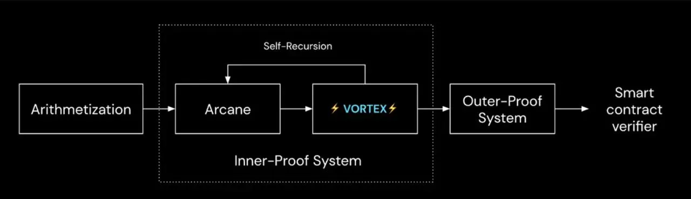
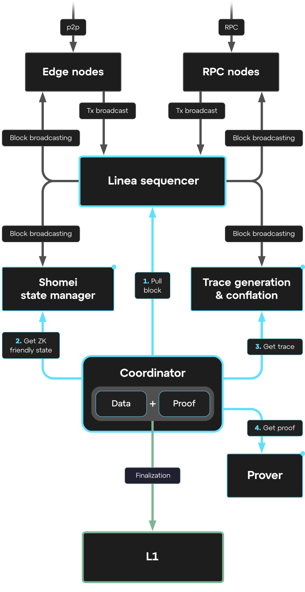

# Linea Rollup Dev Edition

> [!CAUTION]
> This README outlines the steps to set up a development environment. For production use, configuration settings
> must be updated, private keys replaced, and other security considerations applied.

- [Environment overview](#environment-overview)
- [How to run](#how-to-run)
    - [1. Clone the repository](#1-clone-the-repository)
    - [2. Run the nodes](#2-run-the-nodes)
    - [3. Deploy L1 and L2 contracts](#3-deploy-l1-l2-contracts)
    - [4. Run the services](#4-run-the-services)
    - [5. Obtain "trusted" setup files](#5-obtain-trusted-setup-files)
        - [Option 1: Download setup files from S3](#a-if-you-have-access-download-the-setup-files-from-our-s3-bucket)
        - [Option 2: Generate setup files from scratch](#b-generate-the-setup-files-from-scratch)
    - [6. Run the prover](#6-run-the-prover)
- [Proof types](#proof-types)
  - [Execution](#execution)
  - [Compression](#compression)
  - [Aggregation](#aggregation)
  - [Emulation](#emulation)
- [L2 Stack Overview](#l2-stack-overview)
  - [Sequencer](#sequencer)
  - [Shomei](#shomei)
  - [Tracer](#tracer)
  - [Prover](#prover)
  - [Coordinator](#coordinator)
- [Trace limits](#trace-limits)
- [The flow](#the-flow)
- [References](#references)

## Environment overview

The entry point is a `docker-compose.yaml` file that describes all the necessary services. It contains several profiles
that are useful at different steps:

- `prewarm` - run scripts to download and prepare Besu nodes plugins.
- `nodes` - run several L2 nodes. Three mandatory Besu nodes:
    - `sequencer`,
    - `traces-node`,
    - `shomei-node`.

  And an optional geth `l2-node`.
- `services` - runs L2 services, such as:
    - `shomei` - responsible for the zk-evm state management.
    - `coordinator` - responsible for actions coordination between all the L2 services, and L1.
- `full-prover` - runs the prover controller, which spawns provers as requests arrive from the coordinator service. It
  is a heavy service that requires a lot of resources.

## How to run

To run the dev edition, you should install `docker` and `docker-compose`.

### 1. Clone the repository:

```bash
git clone https://github.com/distributed-lab/linea-dev-edition
cd linea-dev-edition
```

### 2. Run the nodes:

```bash
docker compose --profile nodes up -d
```

Now, the L2 RPC (essentially default ETH RPC) should be available at `http://localhost:8845`, as well as `8545`,
`8745`, and `8945`.

### 3. Deploy L1, L2 contracts:

The mandatory L2 contract is the L2MessageService, and the LineaRollup contract for L1, that requires PlonkVerifier,
which can be found at `./prover-assets/3.0.0/devnet/emulation/Verifier.sol`.

You can find the deployment scripts in the [linea-monorepo](https://github.com/Consensys/linea-monorepo) repo,
the `./contracts` directory with well-documented instructions. It is recommended to use the same version as the
prover for compatibility.

> [!IMPORTANT]  
> If you don't want to re-generate a trusted setup in the future, set the next values for the L2MessageService
> deployment:
>
> ```env
> L2MSGSERVICE_SECURITY_COUNCIL="0x3E4837e19201A914738eB50131Dd8Cb5bDA400B3" # sequencer address
> L2MSGSERVICE_L1L2_MESSAGE_SETTER="0x3E4837e19201A914738eB50131Dd8Cb5bDA400B3" # sequencer address
> L2MSGSERVICE_RATE_LIMIT_PERIOD="86400" # 24Hours in seconds
> L2MSGSERVICE_RATE_LIMIT_AMOUNT="1000000000000000000000" # 1000ETH
> ```
>
> And use this private key for deployment: `c9e119d9e6bfa0291265191aea48b6e538ff74e2e41a2e735850b29eb5c0c422`. So,
> the deployed L2MessageService address should be `0x22A4913037A2079fada1b9BfBdc5C81c85781264`.

After the contracts are deployed, you need to use a `setVerifierAddress (0xc2116974)` method of the LineaRollup
contract to set the address of the just deployed PlonkVerifier contract for a `_proofType` `0x1`.

### 4. Run the services:

First of all, one needs to fill missing values in config files, you can find them with "<YOUR_*>" placeholder in
this project. Currently, they are:

- `./config/coordinator/coordinator-docker.config.toml`:
    - l1.rpc-endpoint - your L1 RPC endpoint
    - l1.zk-evm-contract-address - just deployed LineaRollup contract address
    - l2.message-service-address - just deployed L2MessageService contract address
- `./config/prover/v3/prover-config-full.toml`:
    - layer2.message_service_contract - just deployed L2MessageService contract address

Then, run the services:

```bash
docker compose --profile services up -d
```

After some short period of time, you should find the zk-evm traces files at `./local.dev/data/traces/l2/conflated`
directory, as well as proof generation requests at `./local.dev/data/prover`.

### 5. Obtain trusted setup files:

You can find dummy example in the `./prover-assets` directory.

> [!WARNING]
> This trusted setup should be used only for development purposes.

Here you have two options:

#### a. If you have access, download the setup files from our S3 bucket:

> [!IMPORTANT]
> This will be suitable only if the trace limits weren't changed and the L2MessageService contract has an
> address `0x22A4913037A2079fada1b9BfBdc5C81c85781264`.

```bash
aws s3 cp s3://linea-bucket/linea/dev-edition/prover-assets ./prover-assets --recursive
```

#### b. Generate the setup files from scratch:

1. Generate KZG SRS using [gnark-crypto](https://github.com/Consensys/gnark-crypto) tools, that is required for
   the next curves: bls12-377 (size 268435459), bn254 (size 67108864), bw6761 (size 16777216). The files should be
   placed in the `./prover-assets/kzgsrs` directory, and named according to the example there.
2. Generate the circuit-specific setup using `prover setup` command (see the
   [prover](https://github.com/Consensys/linea-monorepo) for details) and config file from
   `linea-dev-edition/config/prover/v3/prover-config-full.toml`.

### 6. Run the prover:

This step isn't possible before the trusted setup files are generated.

> [!Warning]
>
> The prover is configured to use 1100 GB of RAM and 64 CPU. You can change the resources in the
> `docker-compose.yaml` in the `full-prover` service section.

```bash
docker compose --profile full-prover up -d
```

The prover should start processing the proof generation requests, one by one they will be renamed with "inprogress"
statuses. The proof generation process with default parameters takes about an hour, but it depends heavily on the 
used hardware.

> [!Tip]
> The prover uses caches generated once and stored in the `./tmp.dev/prover-artefacts` directory. The
> process of cache generation is time-consuming, but you can download them from the S3 bucket:
>
> ```bash
> aws s3 cp s3://linea-bucket/linea/dev-edition/prover-artefacts ./tmp.dev/prover-artefacts --recursive
> ```

### Possible problems

If the proving failed with a similar log:

```log
prover  | 22:18:08 ERR error="constraint #21921531 is not satisfied: qL⋅xa + qR⋅xb + qO⋅xc + qM⋅(xaxb) + qC != 0 → 0 + -12345 + 0 + 0 + 0 != 0" nbConstraints=36407863
```

Some of the constraints are not satisfied.

Most likely something was changed in your configs and you need to either re-setup the environment with values provided
in this repo or [re-generate trusted setup](#b-generate-the-setup-files-from-scratch). If this didn't help - good luck!

## Proof types

<p align="center">
  
</p>

If we discard the "*-dummy*" ones the Linea has 4 types of proofs that prover can generate:

- *execution* (or with
  bigger [trace limits](#trace-limits)
  *execution-large*)
- *compression*
- *aggregation*
- *emulation*

### Execution

The execution proof validates the correct execution of the Ethereum Virtual Machine (EVM) transactions. The proof system
for the execution has a complex structure:

> Execution Trace → Arithmetization → Arcane + Vortex (*using the Wizard-IOP it creates the polynomial commitments and
the corresponding IOP based on lattice-based cryptography and error-correcting codes*) → PLONK

The final proof is a BLS12-377-based PLONK proof.

### Compression

Linea prover defines the data compression algorithm applied to the conflated trace. The resulting compressed value is
then submitted to the L1. The compression proof ensures that the compressed data submitted on Ethereum (
as [EIP-](https://eips.ethereum.org/EIPS/eip-4844)[4844](https://www.eip4844.com/) blob) can be accurately decompressed,
revealing the necessary inputs for validation. The proof system used for generating the compression proof is PLONK and
is based on the curve BLS12-377.

### Aggregation

Serves as the cornerstone of Linea's proof system, recursively verifying proofs from N execution circuits and M
compression circuit instances.

More precisely, during the generation of this type of proofs, the prover verifies several smaller execution/compression
proofs (done over the BLS12-377 curve) using the PLONK circuit over BW6-761.

> The aggregation proof system uses a combination of several PLONK circuits on BW6, BLS12-377 which tactically profits
> from the 2-chained curves BLS12-377 and BW6 to efficiently recurse the proofs.

### Emulation

The final proof verifies an aggregation proof over the BW6-761 curve in a circuit over the BN254 curve, which can be
efficiently verified on Ethereum thanks to the available precompiles.

## L2 Stack Overview

The Linea stack can be divided into the following logical pieces:

- Sequencer (and other plain nodes)
- Shomei (the Shomei service itself and a Besu node with the corresponding plugin)
- Tracer
- Prover
- Coordinator (coordinator service itself and web3signer)

### Sequencer

> [!Tip]
> - Sequencer plugin: https://github.com/Consensys/linea-sequencer
> - Besu: https://github.com/Consensys/linea-besu

The sequencer is a Besu node launched in the miner (validator) mode. The Linea uses the CLique consensus mechanism, so
the miner (sequencer, validator) address must be specified in the genesis’ `extraData` field.

Sequencer node also requires sequencer plugin to be enabled and configured. In the following
documentation https://github.com/Consensys/linea-sequencer/blob/main/docs/plugins.md#sequencer you can read about how to
configure sequencer plugin.

#### Configuring genesis

The following documentation can be used to configure the genesis
file: https://besu.hyperledger.org/private-networks/tutorials/clique

There are several important fields that should be mentioned:

- `"blockperiodseconds"` determines how often blocks in the network will be generated. Decreasing of this value may
  require increasing the number of provers or/and increasing the prover CPU because the L2 network will have to produce
  proofs more frequently.
- `"createemptyblocks"`  determines if the empty blocks (if no transactions have been submitted to the network) should
  be produced. Setting to true may also cause additional load on the tracer and prover. The recommended value
  is `false`.
- `"extraData"` you can read about how to configure extra data in the following
  documentation: https://besu.hyperledger.org/private-networks/how-to/configure/consensus/clique#extra-data. Basically,
  extra data specifies the address of the initial validator in the network.
- `"alloc"` determines the initial base token allocations and smart contracts deployed in the genesis block.
- Other fields that specify gas parameters, chain ID, start block, etc. can be explored in the Besu documentation.

### Shomei

> [!Tip]
> - Shomei: https://github.com/Consensys/shomei
> - Besu plugin: https://github.com/Consensys/besu-shomei-plugin

Ethereum uses a modified Patricia Merkle Trie for network state storage, but this structure isn't well-suited for
proving systems in a ZK-Rollup context. Therefore, Shomei handles blockchain state collection in a "ZK-friendly" format.

The Besu plugin replicates the state into a Sparse Merkle tree (SMT), using MIMC as the hash function.

The shomei service (launched in two separate instances: shomei itself and API aka shomei-frontend) provides a simple
interface for state retrieval.

Additionally, Shomei plugin provides several RPC methods to request a Merkle Tree Proof of the inclusion of some data
into the state. This proof can be used to prove some statements about the state of L2 on L1.

### Tracer

> [!Tip]
> - Tracer Besu plugin: https://github.com/Consensys/linea-tracer

While Shomei manages the current state, the Tracer (*basically the Tracer is referred to the Besu node with the tracer
plugin*) generates a record of the transactions' changes. This is a step-by-step proof of the state transitions from
point A to the point B.

Unlike Shomei, this functionality is implemented entirely through the Tracer and is accessible via several RPC methods:

- `linea_getConflatedTracesCountersV2`- returns the total count of elements in each column for trace blocks
  from `startBlockNumber` to `endBlockNumber`.
  <details>
    <summary>Response example</summary>

        {
            "jsonrpc": "2.0",
            "id": 1,
            "result": {
                "tracesEngineVersion": "v0.8.0-rc6",
                "from": 253,
                "to": 1422,
                "tracesCounters": {
                    "ADD": 9,
                    "BIN": 15,
                    "BIN_REFERENCE_TABLE": 196864,
                    "BLAKE_MODEXP_DATA": 1,
                    "BLOCK_DATA": 8196,
                    "BLOCK_HASH": 1,
                    "BLOCK_KECCAK": 7,
                    "BLOCK_L1_SIZE": 400,
                    "BLOCK_L2_L1_LOGS": 0,
                    "BLOCK_TRANSACTIONS": 2325,
                    "EC_DATA": 11,
                    "EUC": 14,
                    "EXP": 5,
                    "EXT": 7,
                    "GAS": 3499,
                    "HUB": 143062,
                    "INSTRUCTION_DECODER": 256,
                    "LOG_DATA": 1,
                    "LOG_INFO": 2330,
                    "MMIO": 57374,
                    "MMU": 32660,
                    "MOD": 7,
                    "MUL": 9,
                    "MXP": 4667,
                    "OOB": 20761,
                    "PRECOMPILE_BLAKE_EFFECTIVE_CALLS": 0,
                    "PRECOMPILE_BLAKE_ROUNDS": 0,
                    "PRECOMPILE_ECADD_EFFECTIVE_CALLS": 0,
                    "PRECOMPILE_ECMUL_EFFECTIVE_CALLS": 0,
                    "PRECOMPILE_ECPAIRING_FINAL_EXPONENTIATIONS": 0,
                    "PRECOMPILE_ECPAIRING_G2_MEMBERSHIP_CALLS": 0,
                    "PRECOMPILE_ECPAIRING_MILLER_LOOPS": 0,
                    "PRECOMPILE_ECRECOVER_EFFECTIVE_CALLS": 0,
                    "PRECOMPILE_MODEXP_EFFECTIVE_CALLS": 0,
                    "PRECOMPILE_RIPEMD_BLOCKS": 0,
                    "PRECOMPILE_SHA2_BLOCKS": 0,
                    "RLP_ADDR": 7,
                    "RLP_TXN": 347313,
                    "RLP_TXN_RCPT": 195307,
                    "ROM": 513,
                    "ROM_LEX": 3,
                    "SHAKIRA_DATA": 2,
                    "SHF": 47,
                    "SHF_REFERENCE_TABLE": 2304,
                    "STP": 4,
                    "TRM": 18615,
                    "TXN_DATA": 19778,
                    "WCP": 42079
                }
            }
        }

      </details>

- `linea_generateConflatedTracesToFileV2` - generates conflated traces to the directory defined in the config and
  filename in the next format: `<startBlock>-<endBlock>.conflated.<tracseEngineVersion>.lt`
  e.g. `1-83.conflated.v0.8.0-rc6.lt`.

> The “**conflated**” refers to the blocks that are grouped together into batches; basically, the conflated file
> represents the traces for the batches of blocks.
>
> More precisely, the conflated file specifies the columns with names, length and other parameters that represents the
> trace. You can read about how the trace is generated and its constraints in the following
> doc: https://cdn.consensys.io/uploads/2022/10/07104712/a_specification_for_a_zk_evm.pdf

### Prover

> [!Tip]
> - Prover: https://github.com/Consensys/linea-monorepo

The prover takes conflated traces (witness) and generates a proof of the state transition that can be efficiently
verified (e.g. on-chain).

This is the most computationally intensive and resource-demanding service within the entire system architecture. Due to
the complex mathematical operations and cryptographic calculations involved in the proof generation process, Linea has
specific hardware requirements for optimal performance.

> The recommended system specification is 1 TB of memory and 32+ CPUs. The actual proof generation time heavily depends
> on the trace limits used. For example: with default trace limits, which you can find in
> the [Traces Limits](#trace-limits) section, and 64
> CPU cores, you can expect execution proof generation to take approximately 1750 seconds.

#### Controller

The Prover repository also includes a Controller service that handles filesystem polling automatically. So, when a new
proving request appears, the Controller starts the prover without requiring manual interaction.

### Coordinator

From the name, it is obvious that it’s responsible for the coordination of the work of all the components. The
coordinator starts by listening to new blocks in the network. When a new block appears it checks whether it can be added
to the current conflation. After some trigger, coordinator requests the new conflation. There are several triggers for
conflated trace generation:

1. [**Trace limits**](#trace-limits)
   If adding the new block to the current conflation would cause the number of elements in any column to exceed the
   specified [trace limits](#trace-limits).

  > [!Warning]
  > Although all services use the same trace limits, the coordinator requires several values to be adjusted in its
  > version:
  >
  > ```toml
  >  BIN_REFERENCE_TABLE = 2147483648 
  >  SHF_REFERENCE_TABLE = 2147483648
  >  INSTRUCTION_DECODER = 2147483648
  >  BLOCK_HASH = 2147483648
  >  ```
  > These columns have fixed sizes, but due to some peculiarities of the coordinator's calculations, they are set to the
  > maximum possible value to prevent overflow.

2. **Target block**

  The target blocks in which traces will be generated can be specified in the configuration file.

  ```toml
  [proof-aggregation]
  target-end-blocks=[1024, 2048, 4096]
  ```

3. **Data limit**

  The final proof is submitted on-chain in a couple with the [EIP-4844](https://eips.ethereum.org/EIPS/eip-4844) blob(s).
  Since the blob has a size limit of 128 kB and contains compressed RLP-encoded blocks, it can only contain a finite
  number of blocks.

  > [!NOTE]
  > When conflated traces are generated by another trigger but the data limit hasn't been reached, the data size continues
  > to accumulate conflations for the compression proof. This allows the blob to contain multiple conflations, preventing
  > unnecessary compression proof generation.


4. **Blocks limit (optional)**

  Using config you can set the maximum number of blocks in conflated traces.
  
  ```toml
  [conflation]
  blocks-limit=512
  ```

5. **Time limit**

  You can configure the system to generate conflated traces after a specified time has elapsed since the last
  generation.
  
  ```toml
  [conflation]
  conflation-deadline="PT6H"
  conflation-deadline-check-interval="PT10S"
  ```

When the trigger is reached the coordinator executes the `generateConflatedTracesToFileV2` request on the Tracer,
which generates the conflated trace into a shared folder, and an actual ZK-state from the Shomei service to generate 
a request(s) for proof generation. An execution proof request is generated for any trigger, while a compression proof 
request is only generated when the data limit is reached.

#### Aggregation request trigger
It is also important to mention the triggers for aggregation proof request generation:

1. **Number of proofs** — if the number of proofs to be aggregated exceeds a given threshold.
2. **Deadline** — if no new blocks have appeared for longer than a specified deadline. This deadline is defined in the`[conflation]`config section
  ```toml
  [conflation]
  conflation-deadline-last-block-confirmation-delay="PT20M"
  ```

3. **Target block**
  > [!NOTE]
  > The same parameter is used as a trigger for the conflation trace generation.
  
  The target blocks in which aggregation will be generated can be specified in the configuration file.
  
  ```toml
  [proof-aggregation]
  target-end-blocks=[1024, 2048, 4096]
  ```

## Trace limits

The *traces-limits-v2.toml* example. You can notice the *_large* one, where some of the values are increased, for the
execution-large proof type.

<details>
  <summary>Expand</summary>

    [traces_limits]
    ADD = 524288
    BIN = 262144
    BLAKE_MODEXP_DATA = 16384
    BLOCK_DATA = 1024
    BLOCK_HASH = 512
    EC_DATA = 262144
    EUC = 65536
    EXP = 8192
    EXT = 1048576
    GAS = 65536
    HUB = 2097152
    LOG_DATA = 65536
    LOG_INFO = 4096
    MMIO = 4194304
    MMU = 4194304
    MOD = 131072
    MUL = 65536
    MXP = 524288
    OOB = 262144
    RLP_ADDR = 4096
    RLP_TXN = 131072
    RLP_TXN_RCPT = 65536
    ROM = 4194304
    ROM_LEX = 1024
    SHAKIRA_DATA = 32768
    SHF = 65536
    STP = 16384
    TRM = 32768
    TXN_DATA = 8192
    WCP = 262144
    PRECOMPILE_ECRECOVER_EFFECTIVE_CALLS = 128
    PRECOMPILE_SHA2_BLOCKS = 671
    PRECOMPILE_RIPEMD_BLOCKS = 671
    PRECOMPILE_MODEXP_EFFECTIVE_CALLS = 4
    PRECOMPILE_ECADD_EFFECTIVE_CALLS = 16384
    PRECOMPILE_ECMUL_EFFECTIVE_CALLS = 32
    PRECOMPILE_ECPAIRING_FINAL_EXPONENTIATIONS = 16
    PRECOMPILE_ECPAIRING_MILLER_LOOPS = 64
    PRECOMPILE_ECPAIRING_G2_MEMBERSHIP_CALLS = 64
    PRECOMPILE_BLAKE_EFFECTIVE_CALLS = 600
    PRECOMPILE_BLAKE_ROUNDS = 600
    BLOCK_KECCAK = 8192
    BLOCK_L1_SIZE = 1000000
    BLOCK_L2_L1_LOGS = 16
    BLOCK_TRANSACTIONS = 200
    BIN_REFERENCE_TABLE = 262144
    SHF_REFERENCE_TABLE = 4096
    INSTRUCTION_DECODER = 512
    
    [traces_limits_large]
    ADD = 1048576
    BIN = 524288
    BLAKE_MODEXP_DATA = 32768
    BLOCK_DATA = 2048
    BLOCK_HASH = 1024
    EC_DATA = 524288
    EUC = 131072
    EXP = 16384
    EXT = 2097152
    GAS = 131072
    HUB = 4194304
    LOG_DATA = 131072
    LOG_INFO = 8192
    MMIO = 8388608
    MMU = 8388608
    MOD = 262144
    MUL = 131072
    MXP = 1048576
    OOB = 524288
    RLP_ADDR = 8192
    RLP_TXN = 262144
    RLP_TXN_RCPT = 131072
    ROM = 8388608
    ROM_LEX = 2048
    SHAKIRA_DATA = 65536
    SHF = 131072
    STP = 32768
    TRM = 65536
    TXN_DATA = 16384
    WCP = 524288
    PRECOMPILE_ECRECOVER_EFFECTIVE_CALLS = 256
    PRECOMPILE_SHA2_BLOCKS = 671
    PRECOMPILE_RIPEMD_BLOCKS = 671
    PRECOMPILE_MODEXP_EFFECTIVE_CALLS = 8
    PRECOMPILE_ECADD_EFFECTIVE_CALLS = 32768
    PRECOMPILE_ECMUL_EFFECTIVE_CALLS = 64
    PRECOMPILE_ECPAIRING_FINAL_EXPONENTIATIONS = 32
    PRECOMPILE_ECPAIRING_MILLER_LOOPS = 128
    PRECOMPILE_ECPAIRING_G2_MEMBERSHIP_CALLS = 128
    PRECOMPILE_BLAKE_EFFECTIVE_CALLS = 600
    PRECOMPILE_BLAKE_ROUNDS = 600
    BLOCK_KECCAK = 8192
    BLOCK_L1_SIZE = 1000000
    BLOCK_L2_L1_LOGS = 16
    BLOCK_TRANSACTIONS = 200
    BIN_REFERENCE_TABLE = 262144
    SHF_REFERENCE_TABLE = 4096
    INSTRUCTION_DECODER = 512

</details>

Some columns have a constant size that should not be changed, such as  `BIN_REFERENCE_TABLE`, `SHF_REFERENCE_TABLE`, and `INSTRUCTION_DECODER`.

```toml
BIN_REFERENCE_TABLE = 196864
SHF_REFERENCE_TABLE = 2304
INSTRUCTION_DECODER = 256
```

Note, that in the trace-limits file, corresponding limits has to be equal to the closest next power of two.

Also, as were mentioned before, in the coordinator trace-limits, the limit for these columns equals to the maximum possible value.

```toml
BIN_REFERENCE_TABLE = 2147483648
SHF_REFERENCE_TABLE = 2147483648
INSTRUCTION_DECODER = 2147483648
```

## The flow

<p align="center">
  
</p>

1. The user sends a transaction to the Layer 2 nodes. Since these nodes are interconnected, the transaction is broadcast across the network until it reaches the sequencer node. The sequencer then includes this transaction in the new block and broadcasts it to the other nodes.

   At this point, the first step is complete — the transaction is included in a block within the L2 sequencer.

2. Meanwhile, the Coordinator polls the network for new blocks. When the block arrives, the service adds it to the conflation and checks for triggers. When one of [the triggers](#aggregation-request-trigger) is reached, the Coordinator requests the Tracer to generate conflated traces and the Shomei for the corresponding blockchain state.

   The block and user's transaction are saved to the conflated traces file in a folder shared with the prover, along with requests to generate execution and compression proofs.

3. The Prover calculates execution and compression proofs. 
   a. When the coordinator accumulates the target number of compression proofs (ready blobs), it can publish a submit blob transaction without waiting for the next step. The default target is 6 blobs—the maximum number of blobs allowed per block as defined in [EIP-4844](https://eips.ethereum.org/EIPS/eip-4844#throughput) (Throughput section).

4. The Coordinator waits for [the aggregation trigger](#aggregation-request-trigger) and places a request for the proof generation.

5. Once the emulation proof is ready, the coordinator submits all pending blobs up to the latest block in the aggregated proofs and then the emulation proof to L1 — finalizing all the previous blob submissions.

## References

[1] [Linea monorepo](https://github.com/consensys/linea-monorepo)

[2] [Linea Prover Documentation](https://eprint.iacr.org/2022/1633.pdf)

[3] [Linea documentation](https://docs.linea.build/)

[4] [EIP-4844 documentation](https://eips.ethereum.org/EIPS/eip-4844)